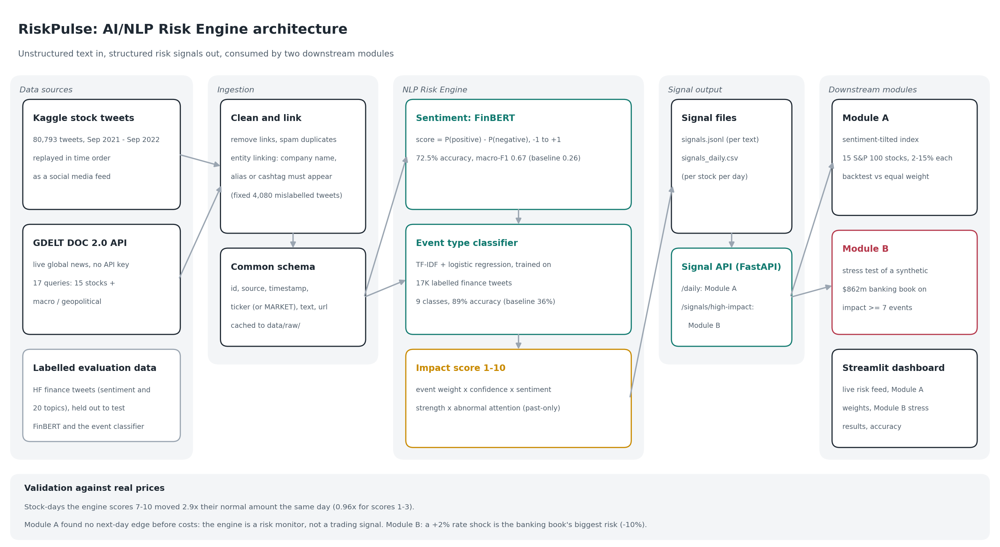

# RiskPulse: AI/NLP Financial Risk Engine - S&P Global & Crisil Campus Hackathon

**Candidate Name:** Avijit Dutta
**College Email ID:** [avijit.dutta2023@vitstudent.ac.in]
**College / Campus:** Vellore Institute of Technology (VIT), Vellore
**Demo Video Link:** [YouTube unlisted link]
**Slide Deck Link (if hosted externally):** Not hosted externally, see [docs/presentation.pdf](docs/presentation.pdf)

---

## 1. Project Overview / Problem Statement & Approach

Financial risk usually shows up in text before it shows up in prices or ratings: a downgrade, a lawsuit, a Fed comment, a sanctions headline. Risk teams cannot read thousands of news articles and posts every hour, so these early signals are missed or acted on late. The task was to build an engine that turns this unstructured stream into **structured, machine-readable risk signals**, and to show two practical uses of them.

**RiskPulse** ingests text from two sources: about 80,000 stock tweets (replayed in time order as a social media feed) and live global news from the GDELT Project. Every text is linked to the company it is really about, then scored three ways: **sentiment** from -1 to +1 with a FinBERT model fine-tuned on labelled finance tweets, an **event type** (Geopolitical, Macroeconomic, Credit Event, Merger/Acquisition, Earnings, Analyst Rating, Legal/Regulatory, Product/Company News, Other) with a classifier trained on labelled finance tweets, and an **impact score** from 1 to 10 that combines event severity, classifier confidence, sentiment strength and abnormal attention. Each part is tested on data it never saw, and the impact score is checked against real price moves.

The signals are written to files and served by a FastAPI **Signal API**, which both downstream modules use. **Module A** tilts a 15-stock S&P 100 index towards stocks with positive news and backtests it against equal weight. **Module B** stress-tests a synthetic $862m wholesale banking book whenever a high-impact event (score 7 or more) is detected, using rate, currency, commodity, geopolitical, credit and company-specific shock scenarios. A Streamlit dashboard shows the live risk feed, the index weights over time, the stress results and the accuracy of every component.

## 2. Architecture & Tech Stack



**Data flow**

1. **Ingestion** (`src/ingestion/`): tweets and GDELT news are cleaned (links removed, spam duplicates dropped) and put into one common schema: `id, source, timestamp, ticker, text, url`. Market-wide news is tagged `MARKET`.
2. **Entity linking** (`src/ingestion/common.py`): a text counts for a company only if it names it (name, alias or cashtag, including old tickers such as `$FB` for Meta). This also fixed a bug in the source data, where the same 4,080 tweets were filed under three different companies.
3. **Sentiment** (`src/nlp/sentiment.py`): FinBERT (`ProsusAI/finbert`) fine-tuned on 8,588 labelled finance tweets (`notebooks/finetune_finbert.ipynb`, free Kaggle GPU) and published as [`avijitdutta/riskpulse-finbert-tfns`](https://huggingface.co/avijitdutta/riskpulse-finbert-tfns). Score = P(positive) - P(negative). Results are cached so each text is scored only once.
4. **Event type** (`src/nlp/events.py`): TF-IDF (word and character n-grams) + logistic regression, trained on 17K labelled finance tweets with 20 topics, grouped into 9 event classes.
5. **Impact score** (`src/nlp/impact.py`): `1 + 9 x (event weight x confidence factor x sentiment strength x attention)`, where attention compares today's number of texts about a stock with its own past 30 days (past data only, so no look-ahead).
6. **Signal output** (`src/pipeline.py`): `data/signals.jsonl` (one signal per text) and `data/signals_daily.csv` (one row per stock per day), served by `src/api.py`.
7. **Module A** (`src/modules/rebalancer.py`) subscribes to daily sentiment; **Module B** (`src/modules/stress_test.py`) subscribes to high-impact events. Both can read from the files or from the running API (`--api`).
8. **Dashboard** (`src/dashboard.py`).

**Tech stack**

| Layer | Tools | Why |
|---|---|---|
| Ingestion | pandas, requests, GDELT DOC 2.0 API | Free, no API key, global news every 15 minutes |
| Sentiment | PyTorch, Hugging Face Transformers, FinBERT (fine-tuned) | Pre-trained on financial language, then fine-tuned on finance tweets: 71.6% to 88.1% accuracy |
| Event type | scikit-learn (TF-IDF + logistic regression) | Trains in about a minute and labels 57K texts in seconds on a CPU; a zero-shot transformer would take hours |
| Signal API | FastAPI, Uvicorn | Simple REST endpoints with automatic interactive docs at `/docs` |
| Modules | pandas, NumPy | Backtest and portfolio revaluation |
| Dashboard | Streamlit, Altair | Interactive charts in pure Python |

**Repository structure**

```
VIT_Vellore-Avijit_Dutta-hackathon/
├── README.md
├── requirements.txt
├── LICENSE
├── .streamlit/config.toml     # dashboard theme
├── notebooks/
│   └── finetune_finbert.ipynb # fine-tunes FinBERT on Kaggle or Colab (free GPU)
├── src/
│   ├── ingestion/             # common.py (schema, entity linking), tweets.py, gdelt.py
│   ├── nlp/                   # sentiment.py, events.py, impact.py
│   ├── modules/               # rebalancer.py (Module A), stress_test.py (Module B)
│   ├── pipeline.py            # runs the whole engine
│   ├── api.py                 # Signal API
│   └── dashboard.py           # Streamlit dashboard
├── data/                      # all data used (see section 3)
└── docs/
    ├── presentation.pdf
    ├── architecture.png
    └── results/               # evaluation results as JSON
```

## 3. Dataset Used

All data is public or synthetic. No real client or confidential data is used.

| File | Source | Used for |
|---|---|---|
| `data/raw/stock_tweets.csv` | Kaggle, "Stock Tweets for Sentiment Analysis and Prediction" (equinxx), Sep 2021 - Sep 2022 | Social media source, replayed in time order |
| `data/raw/stock_yfinance_data.csv` | Same Kaggle dataset, daily prices | Module A backtest, impact validation |
| `data/raw/gdelt.jsonl` | GDELT DOC 2.0 API (cached headlines) | Live news source |
| `data/tfns_train.csv` | Hugging Face `zeroshot/twitter-financial-news-sentiment`, train split (MIT) | Fine-tuning FinBERT |
| `data/tfns_validation.csv` | Same dataset, validation split (MIT) | Testing FinBERT (held out, never used for training) |
| `data/tfn_topic_*.csv` | Hugging Face `zeroshot/twitter-financial-news-topic` (MIT) | Training and testing the event classifier |
| `data/universe.csv` | Built for this project | The 15 S&P 100 stocks and their aliases |
| `data/module_b/portfolio.csv` | Synthetic, generated by `stress_test.py` | Module B banking book (fictional) |
| `data/processed/`, `data/signals_daily.csv`, `data/module_a/`, `data/module_b/` | Produced by the code | Cached engine outputs, so the demo runs offline |

**Assumptions**

- Only English text is processed.
- The X/Twitter API is not free, so historical tweets replace a live social feed. The Kaggle tweets and prices cover Sep 2021 - Sep 2022; GDELT provides the live part.
- NewsAPI was dropped because signing up for a key failed; tweets and GDELT already meet the two-source requirement.
- Texts posted after the 4 pm New York close count towards the next trading day.
- The stock universe is 15 S&P 100 stocks that have real tweet coverage. Procter & Gamble was replaced by Salesforce because only 27 genuine P&G tweets remained after the duplicate fix.
- Module A trades at the close, holds weights for the next day, keeps each stock between 2% and 15%, and pays 10 bps on every change in weight.
- Module B's portfolio is synthetic rather than built from the suggested transaction datasets (Salad Money, Kaggle Financial Transactions): those record retail card spending, which doesn't map onto wholesale banking assets such as bonds, loans and swaps. The book's issuers overlap with the stock universe, so company events can hit specific positions.
- Module B uses first-order sensitivities (beta, duration, spread duration, expected loss) and shock sizes calibrated for an impact-8 event, scaled by impact.

## 4. Quickstart & Installation

**Runtime:** Python [3.x, run `python 3.14.3`] on Windows 11 (Git Bash). Should also work on Linux and macOS.

```bash
git clone https://github.com/avijitdutta1230000-crypto/VIT_Vellore-Avijit_Dutta-hackathon.git
cd VIT_Vellore-Avijit_Dutta-hackathon
python -m venv venv
source venv/Scripts/activate        # Windows (Git Bash)
# source venv/bin/activate          # Linux / macOS
pip install torch --index-url https://download.pytorch.org/whl/cpu
pip install -r requirements.txt
```

**Run the demo (uses the cached data in `data/`, no API keys, works offline):**

```bash
python -m src.pipeline                 # builds the signals (about 1 minute)
python -m src.modules.rebalancer       # Module A backtest
python -m src.modules.stress_test      # Module B stress tests
streamlit run src/dashboard.py         # dashboard at http://localhost:8501
```

**Signal API** (in a second terminal):

```bash
uvicorn src.api:app --port 8000        # interactive docs at http://localhost:8000/docs
python -m src.modules.rebalancer --api # Module A subscribing through the API
python -m src.modules.stress_test --api
```

**Refresh with live news** (internet needed; the fine-tuned FinBERT downloads about 440 MB from Hugging Face the first time):

```bash
python -m src.ingestion.gdelt          # about 5 minutes, GDELT allows one request every few seconds
python -m src.pipeline
```

**Reproduce the accuracy tests:**

```bash
python -m src.nlp.sentiment            # fine-tuned FinBERT on held-out labelled tweets
python -m src.nlp.sentiment --base     # original FinBERT on the same tweets, for comparison
python -m src.nlp.events               # event classifier on the held-out validation split
```

To repeat the fine-tuning itself, upload `notebooks/finetune_finbert.ipynb` to Kaggle or Colab, switch on a GPU and run it top to bottom (about 10 minutes).

## 5. Key Results & Domain Impact

**Every part of the engine was tested on data it never saw**

| Component | Tested on | Result | Naive baseline |
|---|---|---|---|
| Sentiment (fine-tuned FinBERT) | 2,388 held-out labelled finance tweets | **88.1% accuracy, macro-F1 0.85** | Original FinBERT 71.6% / 0.66; always "neutral" 65.6% / about 0.26 |
| Event type | 4,117 labelled finance tweets | **89.0% accuracy, macro-F1 0.87** | 35.8% (always "Other") |
| Impact score | about 3,000 stock-days against real prices | **Score 7-10 days moved 3.2x normal the same day** | Score 1-3 days: 0.96x |

**Fine-tuning:** FinBERT was fine-tuned on 8,588 tweets from the dataset's training split, with 955 more kept aside to choose the best epoch. The 2,388 test tweets were used once, at the end. Accuracy rose from 71.6% to 88.1%, and only 27 of the 2,388 test tweets (1.1%) are now given the wrong direction (positive called negative or the reverse). FinBERT was deliberately *not* tested on Financial PhraseBank, because it was originally trained on it and the score would be inflated.

**What the engine produced:** 56,931 signals from 56,819 cleaned tweets (80,793 raw) and the GDELT headlines; 117 scored 7 or more. The impact score ranks price moves better than simply counting tweets (rank correlation 0.078 vs 0.059).

**Module A, sentiment-tilted index (Oct 2021 - Sep 2022):** -32.1% a year against -32.3% for equal weight in a severe tech bear market, so +0.14% a year *after* 10 bps trading costs (information ratio 0.26). With the original FinBERT it trailed by 0.6% a year; fine-tuning turned that around, and 6 of 9 robustness settings now beat equal weight (every setting with a 3- or 7-day half-life). The edge is still too small to trade on, and the impact check explains why: high-impact days move 3.2x normal on the same day but only 1.2x the next day, because most tweets react to moves that already happened. **The engine is a strong real-time risk monitor, not a next-day trading signal.**

**Module B, stress testing:** 31 stress tests were triggered by high-impact events (13 market-wide, 18 company-specific; 17 more company events were skipped because the book holds nothing in them). The triggers are real 2022 events: inflation warnings from Meta, Amazon and Apple in early 2022 set off rate-shock scenarios (-$43.8m each), and the story that Florida taxpayers could face Disney's $1B district debt (22 Apr 2022, impact 9) set off a Disney credit scenario (-$14.2m). The what-if analysis shows a **+2% rate shock costs this book about 10%**, four times more than a geopolitical shock, because two thirds of it is bonds and loans.

**Why it matters**

- **Early warning for risk teams:** analysts get a ranked feed of the events that move prices, with the company, event type and severity already extracted, instead of reading thousands of posts.
- **Event-driven stress testing:** a bank can see what a breaking event would do to its book the moment it is reported, instead of waiting for a scheduled stress exercise.
- **Explainability:** every weight change and every stress test traces back to the exact headline or tweet that triggered it, which matters for audit and regulators.
- **Honest evaluation:** each model is compared with a naive baseline, and results that did not work (Module A's next-day edge) are reported, not tuned away.

## 6. Limitations & Next Steps

- FinBERT was fine-tuned on news-style finance tweets, but the Kaggle tweets are retail chatter, so posts like "INTEL EARNINGS THREAD" can still score as strongly positive. Fine-tuning further on labelled retail stock tweets is the next step.
- The event classifier is word-based, so slang can fool it ("Gold secured! $TSLA" was labelled Macroeconomic).
- The impact score uses hand-set event weights; the next step is learning them from realised price moves.
- Only 49 stock-days scored 7 or more, so the price-move result is strong evidence but not proof. Better sentiment sharpened the top alerts (2.9x to 3.2x) but did not improve the overall ranking (rank correlation 0.085 to 0.078).
- Module B shocks are fixed per scenario and scaled by impact; a real bank would size each shock to the specific event and use full repricing.
- The free GDELT API rate-limits heavy use, so the live feed is near-real-time rather than streaming.

## 7. AI Assistance

An AI assistant (Claude) was used to help draft and debug code and documentation. All design decisions, runs, results and their interpretation were reviewed and understood by me.

## License

MIT, see [LICENSE](LICENSE).
